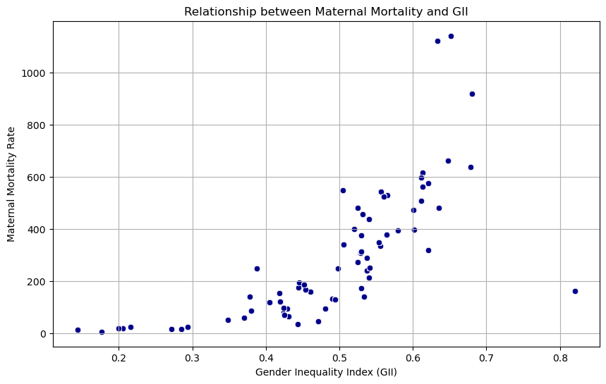
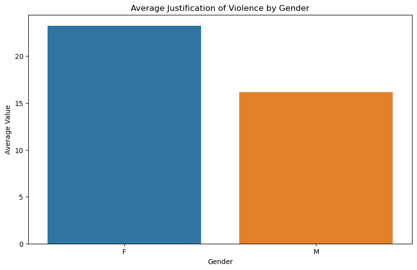
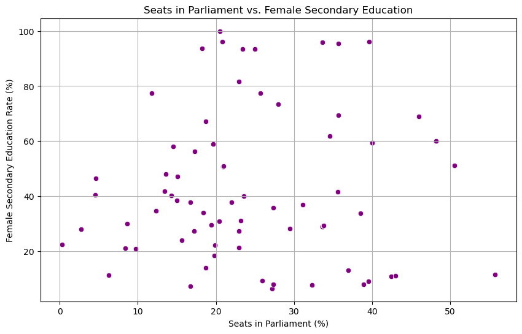

# Gender Inequality & Violence Analysis using Data Science

This project explores the relationship between gender inequality, societal attitudes, and violence against women using statistical analysis and machine learning techniques.

---

## 🚀 Project Overview

Violence against women is a global issue rooted in structural inequality and societal norms.

This project analyzes international datasets to:

- Understand the relationship between gender inequality and health outcomes  
- Explore societal attitudes toward violence  
- Identify patterns in women's education and empowerment  

The goal is to provide data-driven insights into one of the most critical social challenges worldwide.

---

## 📂 Dataset

This project combines two datasets:

### 1. Gender Inequality Index (GII)
- 190+ countries  
- Health, education, and economic indicators  

### 2. Violence Against Women Dataset (DHS)
- 12,000+ survey responses  
- Attitudes toward justification of violence  
- Sociodemographic variables  

Data was merged using country-level mapping and cleaned for consistency.

👉 Dataset sample:  
[View full dataset](./data/final_cleaned_data.csv)

---

## 🔬 Methodology

### Data Wrangling

- Left join on country  
- Standardization of country names  
- Missing value imputation (median/mode)  
- Duplicate removal  

---

### Exploratory Data Analysis

### Gender Inequality vs Maternal Mortality

- Strong positive relationship between inequality and maternal mortality  
- Countries with higher GII show significantly worse health outcomes  

---

### Violence Justification by Gender

- Women report higher justification levels  
- Reflects internalized societal norms and cultural influence  

---

### Education vs Political Representation

- Weak but visible relationship between education and representation  
- Indicates structural and societal factors beyond education  

---

## 📊 Modeling

### Linear Regression (OLS)

- Target: Maternal Mortality  
- Predictor: Gender Inequality Index  

Results:

- R² ≈ **52.1%**  
- +1 increase in GII → +1391 maternal deaths  
- Strong statistical significance  

---

### Logistic Regression

- Predict gender based on violence justification  

Results:

- Accuracy ≈ **59.8%**  
- Better performance for males than females  
- Indicates limited predictive power of attitudes alone  

---

## 🧠 Key Insights

- Gender inequality strongly impacts maternal health outcomes  
- Societal norms influence acceptance of violence  
- Education alone is not sufficient for empowerment  
- Structural inequalities drive global disparities  

---

## 🛠️ Tech Stack

---

## 🔮 Future Work

- Extend analysis to country-specific case studies (e.g., Türkiye)  
- Improve predictive models with additional features  
- Apply causal inference methods  
- Incorporate time-series analysis  

---

## ⚡ Implementation

All analysis and modeling code is available in the `notebooks/Dashboard.ipynb` directory.

---

## 👩‍💻 Author

**Irem Akcan**
